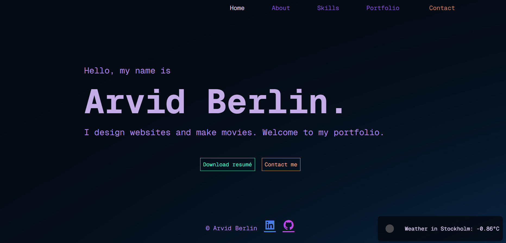
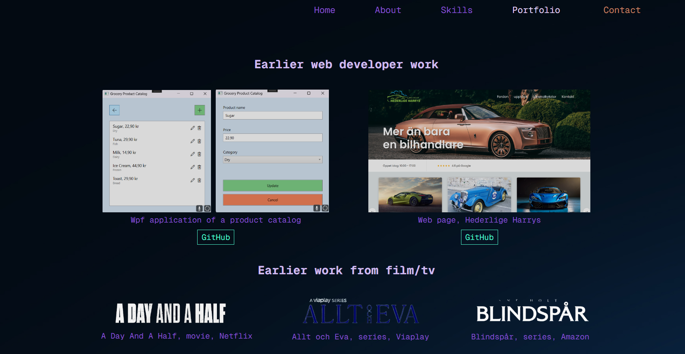

# Arvid Berlin's Portfolio

Welcome to my web portfolio! This project is designed to act as an interactive CV, showcasing my skills and previous work as a web developer and in the film/TV industry.

## Live Demo

[Click here to view the portfolio](http://127.0.0.1:5501/index.html)

## Features

- **Home Page (Index)**:
  - Displays my name, a short introduction, and two buttons:
    - "Download Resume" with a confirmation popup.
    - "Contact Me" that links to the contact form.
  - Weather API showing the current temperature in Stockholm.
  - Navigation bar and footer available on all sections with links to other pages and my GitHub/LinkedIn.

- **About Page**:
  - Profile picture with a brief introduction about who I am, what I do, and my interests.

- **Skills Page**:
  - Displays my skills in two categories:
    1. Web Development: HTML5, CSS3, JavaScript, C#, and Bootstrap.
    2. Film/TV Editing: Adobe Premiere Pro, DaVinci Resolve, and Avid Media Composer.

- **Portfolio Page**:
  - Showcases:
    - Two previous web development projects with GitHub links.
    - Film/TV projects with title icons.
  - Reference section with names and images of two past employers.

- **Contact Page**:
  - A contact form allowing users to send me their name, email, and a message.
  - Table displaying my contact details.

## Technologies Used

- **Frontend**: HTML5, CSS3, JavaScript
- **External API**: Weather API for real-time weather data

## Design Principles

During the development of this portfolio, I applied the following design principles:

- **Contrast**: Used a dark background with light text and accent colors to highlight important elements such as buttons and headings.
- **Balance**: Elements are evenly distributed to create a harmonious layout.
- **Emphasis (Accent)**: Key elements, such as the "Download Resume" and "Contact Me" buttons, are highlighted with vibrant colors.
- **Proportion and Hierarchy**: Larger text size is used for names and headings to guide the user's attention.
- **Repetition and Rhythm**: Repeated colors, fonts, and elements for a consistent design.
- **Pattern and Whitespace**: Careful use of whitespace to create breathing room between sections.
- **Movement and Variation**: The navigation and weather API add dynamic elements.
- **Unified Design**: A consistent color scheme and style ensure cohesion.

## CRAP Principles

- **Contrast**: Sharp contrast between background, text, and buttons ensures readability.
- **Repetition**: Navigation bar, footer, and color schemes are consistently used throughout the portfolio.
- **Alignment**: All content is organized with strict left, center, or right alignment for a professional appearance.
- **Proximity**: Related information is grouped together, improving the user experience.

## Color Scheme

I chose a **monochromatic color scheme** with varying shades of dark blue and purple for the background and text, complemented by accent colors in orange and green for interactive elements. This gives the portfolio a modern and sophisticated feel.

## Typography and Styling

- **Primary Font**: "GeistMono", a modern sans-serif font, is used for clarity and readability.
  - Font source: `url(fonts/GeistMono-VariableFont_wght.ttf)`
- **Font Styling**:
  - Larger fonts for headings and key text, smaller fonts for secondary text to enhance hierarchy.
  - **Font Weight**: Bolder weight for headings, lighter for body text.
  - Italics and bold are used sparingly for emphasis.

## Icons and Graphical Elements

- **Icons**: Social media icons (GitHub and LinkedIn) in the footer are simple and clear, providing quick access to my profiles.
- **Visual Elements**: Minimalistic patterns and icons ensure the design remains clean and user-friendly.

## Preview

### Home Page

### Portfolio Page

## How to Use

This repository does not require any setup or installation for local usage. Simply open `index.html` in a web browser to explore the portfolio.

## Contact

If you have any questions or want to connect, feel free to reach out through the portfolio links to my GitHub or LinkedIn!